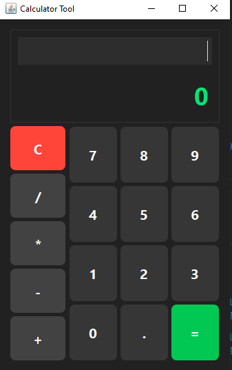

# Java Calculator Tool

A modern, user-friendly calculator application built with Java Swing.



## Features

- Clean, dark-themed UI with rounded buttons
- Two-part display showing both input expression and result
- Basic arithmetic operations (addition, subtraction, multiplication, division)
- Keyboard input support
- Clear button to reset calculations

## Usage

### Running the Application

1. Ensure you have Java installed on your system
2. Compile the Java file:
   ```
   javac CalculatorTool.java
   ```
3. Run the compiled class:
   ```
   java CalculatorTool
   ```

### Controls

- **Mouse**: Click the buttons on the calculator interface
- **Keyboard**: Type expressions directly, press Enter to calculate
- **Clear**: Click the C button or press 'C' or Esc to reset

## Code Structure

The application uses:
- Java Swing for the UI components
- Custom button styling with rounded corners
- Two-stack algorithm for expression evaluation
- Event-driven architecture for user interactions

## Implementation Details

- Modern dark theme with intuitive color coding
  - Operations in dark gray with green text
  - Numbers in medium gray with white text
  - Clear button in red
  - Equals button in green
- Input validation to prevent calculation errors
- Responsive layout that scales appropriately

## Requirements

- Java Runtime Environment (JRE) 8 or higher

## Future Enhancements

- Memory functions (M+, M-, MR, MC)
- Scientific calculator mode
- Calculation history
- Customizable themes

## License

MIT License

## Author

Copyright © 2025

---

*This calculator was developed as a showcase of Java Swing capabilities for creating modern desktop applications.*
